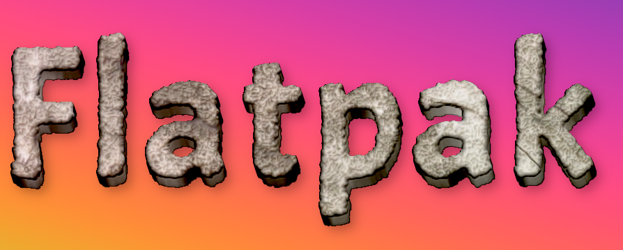

This filter will only work proper on  Gimp 2.10.32 and up. 

FILTER REQUIRES  [https://github.com/LinuxBeaver/GEGL-Custom-Bevel](https://github.com/LinuxBeaver/GEGL-Custom-Bevel/releases)
and
[https://github.com/LinuxBeaver/GEGL-Extrusion-2----Fork-of-GEGL-Long-Shadow/ ](https://github.com/LinuxBeaver/GEGL-Extrusion-2----Fork-of-GEGL-Long-Shadow/releases) to work. 
It will NOT WORK AT ALL WITHOUT THESE TWO ADDITIONAL FILTERS. All the end user has to do is download the release files but one can compile if they want.


## OS specific location to put GEGL Filter binaries 

Windows
 C:\\Users\<YOUR NAME>\AppData\Local\gegl-0.4\plug-ins
 
 Linux 
 /home/(USERNAME)/.local/share/gegl-0.4/plug-ins
 
 Linux (Flatpak)
 /home/(USERNAME)/.var/app/org.gimp.GIMP/data/gegl-0.4/plug-ins


## Compiling and Installing

### Linux

To compile and install you will need the GEGL header files (`libgegl-dev` on
Debian based distributions or `gegl` on Arch Linux) and meson (`meson` on
most distributions).

```bash
meson setup --buildtype=release build
ninja -C build

```
This is the first filter of mine that will NOT work on GEGL 0.3 - You need to have a recent GEGL 0.4 or figure out how to get DCT-Noise on GEGL 0.3


### Windows

The easiest way to compile this project on Windows is by using msys2.  Download
and install it from here: https://www.msys2.org/

Open a msys2 terminal with `C:\msys64\mingw64.exe`.  Run the following to
install required build dependencies:

```bash
pacman --noconfirm -S base-devel mingw-w64-x86_64-toolchain mingw-w64-x86_64-meson mingw-w64-x86_64-gegl
```

Then build the same way you would on Linux:

```bash
meson setup --buildtype=release build
ninja -C build
```


